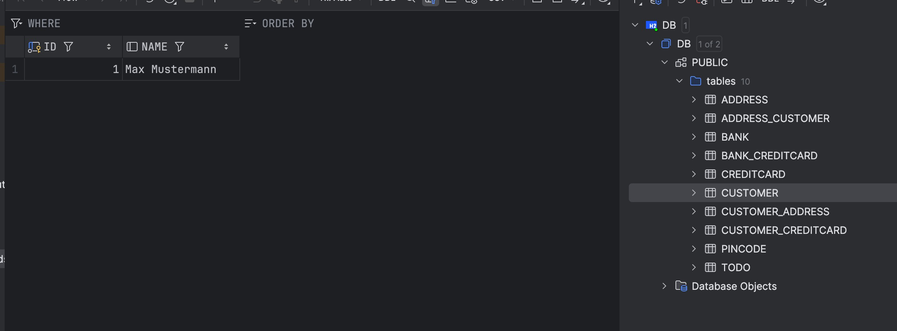

## Expass 4

In this expass I had a introduction to JPA and made a app with it.

### Technical problems that you encountered during installation and use of Java Persistence Architecture (JPA) and how you resolved

I didn´t expirience any major problems durind the installation of JPA.
In the use of the JPA I didn´t expirience any major problems either, the tutorial helped a lot.

### A link to your code for experiment 2 above. Make sure the included test case passes!

Link to the github repo which I forked for thie expass:
https://github.com/KaroGil/dat250-jpa-tutorial

Link to the specific folder for experiment 2:
https://github.com/KaroGil/dat250-jpa-tutorial/tree/master/src/main/java/no/hvl/dat250/jpa/tutorial/creditcards

### An explanation of how you inspected the database tables and what tables were created. For the latter, you may provide screenshots.

### Questions:

#### Explain the used database and how/when it runs.

The database used in this experiment runs by using H2 relational database for testing purposes. It is initialized when the application starts or when JPA operations are initialized (persisting entities).

#### Can you provide the SQL used to create the table Customer?

```
CREATE TABLE Customer (
id BIGINT PRIMARY KEY AUTO_INCREMENT,
name VARCHAR(255)
);
```

#### Find a way to inspect the database tables being created and create a database schema in your report. Do the created tables correspond to your initial thoughts regarding the exercise?

I inspected the database tables by using the integrated tool in IntelliJ. This allowed me to see how the databases were sat up and understand the project better.



### Any pending issues with this assignment that you did not manage to solve

There aren´t any pending issues.
